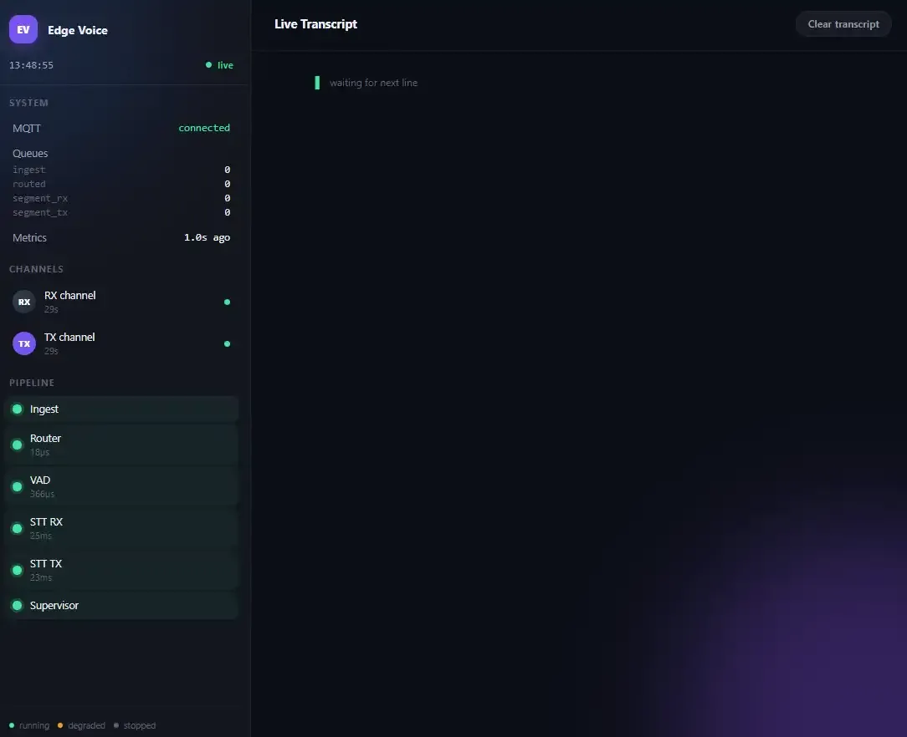
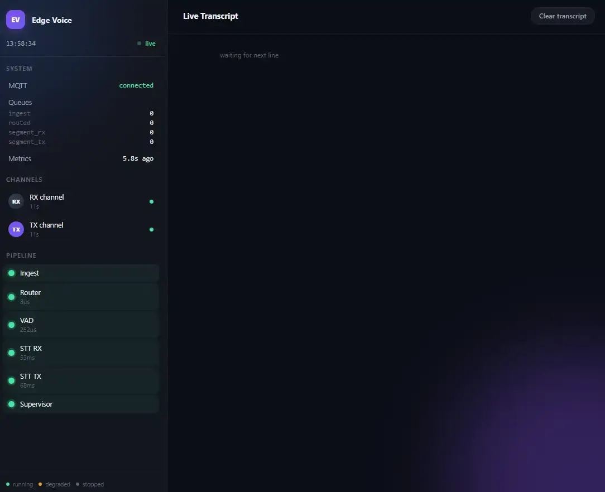

# edge-voice

Real-time, dual-channel (Rx/Tx) transcription for edge devices using Silero VAD for speech segmentation and Moonshine for multilingual STT. Light enough to run on a CPU — no GPU or NPU required — with partial (streaming) transcripts emitted before a turn finishes speaking. Built for any two-party audio source, where each party's audio arrives as its own MQTT stream and is transcribed independently, in order, with channel attribution preserved throughout.

## Demo

<p align="center"><b>English</b></p>
<p align="center">
  
</p>

<p align="center"><b>Korean (multilingual)</b></p>
<p align="center">
  
</p>

## Architecture

Two logically separate pieces talk only over MQTT; everything after ingestion runs in-process on worker threads connected by bounded queues:

<p align="center">
  
</p>

`MqttAudioIngest → ChannelRouter → VADWorker → STTWorker` communicate via in-memory `queue.Queue`s — no MQTT between pipeline stages, only at the boundary.

## Requirements

- **Tested on Ubuntu 24.04 and RPi5** — other Linux distributions likely work but aren't verified
- **Python 3.12**
- **Internet access during installation** — `pip install` fetches dependencies and model weights (Silero VAD, Moonshine); no network access is needed at runtime afterward
- **An MQTT broker**, reachable by the pipeline (`localhost:1883` by default — see [Configuration](#configuration)) — audio ingestion is MQTT-only, there's no direct-mic-to-pipeline path in production
  - Debian/Raspberry Pi OS: `make install` / `install.sh` installs and starts [Mosquitto](https://mosquitto.org/) via `apt`
  - Other platforms: install and run a broker yourself
- **PortAudio**, for live mic capture (`--mic` / `mic_source.py`)
  - Debian/Raspberry Pi OS: `make install` / `install.sh` installs it via `apt`
  - Other platforms: install it yourself

## Getting started

Pick the path that matches what you're doing — both clone the repo and install the same core dependencies; they differ in whether they set up a dev environment or a standing service.

### Development

```bash
git clone https://github.com/Michae1Park/edge-voice.git
cd edge-voice

python3.12 -m venv venv
source venv/bin/activate

make install   # apt: mosquitto, mosquitto-clients, libportaudio2 -- then pip install -e ".[dev]"
make test      # optional: confirms the install worked

edge-voice     # starts the pipeline
```

It's running, but needs audio — pick how to feed it in [Running the pipeline](#running-the-pipeline) below.

### Standing deployment (systemd)

For an unattended install that survives reboots/crashes (see [`deploy/edge-voice.service`](deploy/edge-voice.service), `pipeline/supervisor.py`):

```bash
git clone https://github.com/Michae1Park/edge-voice.git
cd edge-voice

./install.sh

systemctl status edge-voice

# hand-edited deploy/edge-voice.service directly instead? redeploy with:
make install-service
```

`install.sh` installs the same deps as `make install` (minus `[dev]` extras), then templates and enables `deploy/edge-voice.service` for this path/user and starts it immediately — `systemctl status` above confirms it's running. See [Troubleshooting](#troubleshooting) for deeper checks, or re-run `install.sh` anytime to update deps.

## Running the pipeline

*(Not needed for a [Standing deployment](#standing-deployment-systemd) — the `edge-voice` systemd service already has this covered.)*

Needs an MQTT broker (`localhost:1883` by default — see [Configuration](#configuration)). Three ways to feed it audio:

**1. Live mic capture** — run this instead of the plain `edge-voice` above:

```bash
edge-voice --mic
```

Spawns [`mic_source.py`](src/edge_voice/utils/audio_generation/mic_source.py) as a subprocess, publishing the default input device to the `rx` channel over MQTT, resampled to the pipeline's rate, stopped automatically when `edge-voice` exits. To pick a device, list channels, or run capture standalone (e.g. against a pipeline on another machine):

```bash
python -m edge_voice.utils.audio_generation.mic_source --list-devices
python -m edge_voice.utils.audio_generation.mic_source --device 2 --channels rx
```

**2. Replay a recording** — works with the plain `edge-voice` above, no live source needed:

```bash
# one file per channel, e.g. two call legs
python -m edge_voice.utils.audio_generation.wav_source \
    --wav wav/rx_recorded_1.wav wav/tx_recorded_1.wav --channels rx tx
```

**3. Publish MQTT audio packets yourself** — any publisher works: a live feed, a radio bridge, whatever fits your setup. See [Configuration](#configuration) for the topics/wire format `edge-voice` expects.

Useful `edge-voice` flags:

| Flag | Default | Description |
|---|---|---|
| `--run-secs N` | `0` | Exit automatically after `N` seconds (`0` = run until Ctrl-C) |
| `--debug` | off | Verbose (`DEBUG`-level) logging |
| `--mic` | off | Also launch a live mic capture, publishing to the `rx` channel over MQTT |

## Configuration

Settings are layered, lowest to highest precedence:

1. Code defaults (`config/settings.py`)
2. [`configs/default.yaml`](configs/default.yaml)
3. `configs/local.yaml` (gitignored, optional per-deployment overrides)
4. Environment variables: `EDGE_VOICE__<SECTION>__<FIELD>`, e.g. `EDGE_VOICE__VAD__THRESHOLD=0.5`

`configs/default.yaml` documents every tunable inline — MQTT broker/topics, audio format, VAD thresholds and segment-cut limits, STT model/language selection, and queue sizes.

## Troubleshooting

If transcription seems slower than expected, confirm the process layout and env actually match what you intended before digging further. Find the running process and its STT child processes (the binary is `edge-voice`, hyphenated — `pgrep -f edge_voice` will find nothing):

```bash
pgrep -af edge-voice
PARENT=$(pgrep -f edge-voice | head -1)
ps --ppid "$PARENT" -o pid,cmd | grep spawn_main   # STT worker child processes
```

Expect one match per configured channel — two (`rx`, `tx`) with the default config. Fewer means a channel's STT worker isn't running.

Confirm `MOONSHINE_ORT_SINGLE_THREAD` actually reached a running process, not just that you set it somewhere (`spawn` inherits env at fork time, so a stale shell or service env can silently drop it). Use one of the STT child PIDs from above, not the parent — the parent always has it (`cli.py` sets the default before spawning), so checking it doesn't test anything:

```bash
cat /proc/<pid>/environ | tr '\0' '\n' | grep MOONSHINE_ORT_SINGLE_THREAD
```

Expect `MOONSHINE_ORT_SINGLE_THREAD=1`. No output means it didn't reach the child.

## Development

```bash
make lint        # ruff check .
make format      # ruff format .
make typecheck   # mypy --package edge_voice
make test        # pytest
make ci          # all of the above, what CI runs
```

CI runs the same checks (`.github/workflows/ci.yml`) on every push and pull request against `main`.

## Third-party models

**Powered by [Moonshine AI](https://www.moonshine.ai).**

This project uses two pretrained models, under two different licenses:

- **[Silero VAD](https://github.com/snakers4/silero-vad)** — MIT license.
- **[Moonshine](https://www.moonshine.ai)** (STT) — the `moonshine_voice` client library is MIT, but the model weights are not: multilingual models (`ko`, `ja`, etc. — see `configs/default.yaml` for the full list) are released under the **[Moonshine AI Community License](https://www.moonshine.ai/moonshine_community_license.txt)**, while English (`en`) models are MIT instead (see the license for full commercial-use terms). This Moonshine AI Model is licensed under the Moonshine AI Community License.
