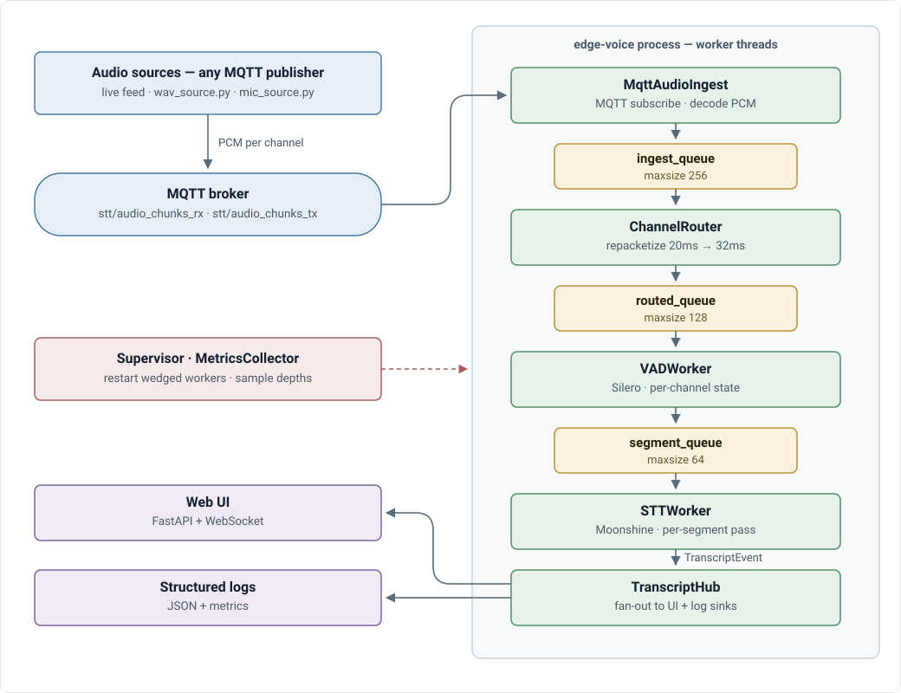

# edge-voice

Real-time, dual-channel (Rx/Tx) transcription for edge devices using Silero VAD for speech segmentation and Moonshine for streaming STT. Built for any two-party audio source, where each party's audio arrives as its own MQTT stream and is transcribed independently, in order, with channel attribution preserved throughout.

See [`docs/ARCHITECTURE.md`](docs/ARCHITECTURE.md) for the full design doc and [`docs/BUILDPLAN.md`](docs/BUILDPLAN.md) for current status and what's next.

## Architecture

Two logically separate pieces talk only over MQTT; everything after ingestion runs in-process on worker threads connected by bounded queues:

<p align="center">
  
</p>

`MqttAudioIngest → ChannelRouter → VADWorker → STTWorker` communicate via in-memory `queue.Queue`s — no MQTT between pipeline stages, only at the boundary.

## Requirements

- Python 3.12
- An MQTT broker reachable by the pipeline — audio ingestion is MQTT-only, there is no direct-mic-to-pipeline path in production use
- The native PortAudio library, for live mic capture (`--mic` / `mic_source.py`)

On Debian/Raspberry Pi OS, `make install` installs both via `apt` ([`mosquitto`](https://mosquitto.org/) + `mosquitto-clients`, and `libportaudio2`) — apt starts the broker on `localhost:1883`, matching the defaults in [Configuration](#configuration). On other platforms, install them yourself; only the `pip install` line in the `install` target applies.

## Quick start

```bash
git clone https://github.com/Michae1Park/edge-voice.git
cd edge-voice

python3.12 -m venv venv
source venv/bin/activate

make install   # apt: mosquitto, mosquitto-clients, libportaudio2 -- then pip install -e ".[dev]"
make test      # pytest
```

## Running the pipeline

The pipeline consumes audio over MQTT, so it expects a broker running (`localhost:1883` by default — see [Configuration](#configuration); `make install` sets this up on Debian/Raspberry Pi OS) and something publishing per-channel audio to it. That something can be any MQTT publisher — a live audio feed streamed in from elsewhere, a radio bridge, whatever fits your setup — in which case Terminal 1 below is all you need to run.

**Terminal 1 — start the pipeline:**

```bash
edge-voice
# or: python -m edge_voice.cli
```

**Terminal 2 (optional) — publish pre-recorded audio to it:**

If you don't already have a live source publishing to MQTT, `wav_source.py` replays a `.wav` file over MQTT the same way one would — useful for local development/demos:

```bash
# Real recorded audio, one file per channel (e.g. two call legs)
python -m edge_voice.utils.audio_generation.wav_source_raw \
    --wav wav/rx_recorded_1.wav wav/tx_recorded_1.wav --channels rx tx
```

**Or, to use a real microphone instead:**

```bash
edge-voice --mic
```

This spawns [`mic_source.py`](src/edge_voice/utils/audio_generation/mic_source.py) as a subprocess alongside the pipeline, capturing from the system's default input device and publishing to the `rx` channel over MQTT (same wire format as any other audio source — the mic isn't wired into the pipeline directly). It captures at the device's native sample rate and resamples to match the pipeline's configured rate. It's shut down automatically when `edge-voice` exits.

To pick a specific device, list channels, or run the mic capture on its own (e.g. against a pipeline on another machine), invoke it directly instead:

```bash
python -m edge_voice.utils.audio_generation.mic_source --list-devices
python -m edge_voice.utils.audio_generation.mic_source --device 2 --channels rx
```

Useful `edge-voice` flags:

| Flag | Default | Description |
|---|---|---|
| `--run-secs N` | `0` | Exit automatically after `N` seconds (`0` = run until Ctrl-C) |
| `--debug` | off | Verbose (`DEBUG`-level) logging |
| `--mic` | off | Also launch a live mic capture, publishing to the `rx` channel over MQTT |

## Configuration

Settings are layered, lowest to highest precedence:

1. Code defaults (`config/settings.py`)
2. [`configs/default.yaml`](configs/default.yaml)
3. `configs/local.yaml` (gitignored, optional per-deployment overrides)
4. Environment variables: `EDGE_VOICE__<SECTION>__<FIELD>`, e.g. `EDGE_VOICE__VAD__THRESHOLD=0.5`

`configs/default.yaml` documents every tunable inline — MQTT broker/topics, audio format, VAD thresholds and segment-cut limits, STT model/language selection, and queue sizes.

## Deployment

For a deployment that should survive reboots and auto-restart on crash/hang (see [`deploy/edge-voice.service`](deploy/edge-voice.service) and `pipeline/supervisor.py`), install it as a systemd unit instead of running `edge-voice` directly:

```bash
make install-service   # sudo cp deploy/edge-voice.service /etc/systemd/system/, daemon-reload, enable --now
```

Edit `User=`, `WorkingDirectory=`, and `ExecStart=` in `deploy/edge-voice.service` to match your install (venv path, user) before running this — the checked-in values are placeholders. Re-run `make install-service` any time you change that file.

### Sanity-checking a running deployment

If transcription seems slower than expected, confirm the process layout and env actually match what you intended before digging further. Find the running process and its STT child processes (the binary is `edge-voice`, hyphenated — `pgrep -f edge_voice` will find nothing):

```bash
pgrep -af edge-voice
PARENT=$(pgrep -f edge-voice | head -1)
ps --ppid "$PARENT" -o pid,cmd | grep spawn_main   # STT worker child processes
```

Confirm `MOONSHINE_ORT_SINGLE_THREAD` actually reached a running process, not just that you set it somewhere (`spawn` inherits env at fork time, so a stale shell or service env can silently drop it):

```bash
cat /proc/<pid>/environ | tr '\0' '\n' | grep MOONSHINE_ORT_SINGLE_THREAD
```

## Development

```bash
make lint        # ruff check .
make format      # ruff format .
make typecheck   # mypy --package edge_voice
make test        # pytest
make ci          # all of the above, what CI runs
```

CI (`.github/workflows/ci.yml`) runs `make ci` equivalent checks on every push and pull request against `main`.

## Project status

Core pipeline (MQTT ingest → routing → VAD → STT) is real end-to-end, with worker supervision/restart, observability (structured logging + metrics), health reporting, and a live web UI all built — see [`docs/BUILDPLAN.md`](docs/BUILDPLAN.md) for the milestone-by-milestone breakdown.

## Third-party models

**Powered by [Moonshine AI](https://www.moonshine.ai).**

This project uses two pretrained models, under two different licenses:

- **[Silero VAD](https://github.com/snakers4/silero-vad)** — MIT license.
- **[Moonshine](https://www.moonshine.ai)** (STT) — the `moonshine_voice` client library is MIT, but the model weights are not: multilingual models (`ko`, `ja`, etc. — see `configs/default.yaml` for the full list) are released under the **[Moonshine AI Community License](https://www.moonshine.ai/moonshine_community_license.txt)**, while English (`en`) models are MIT instead (see the license for full commercial-use terms). This Moonshine AI Model is licensed under the Moonshine AI Community License.
